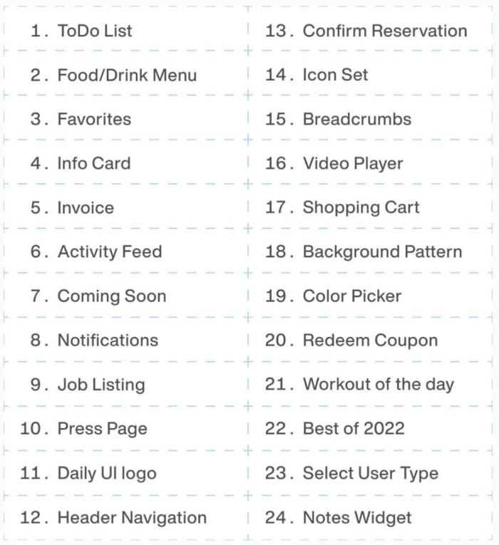
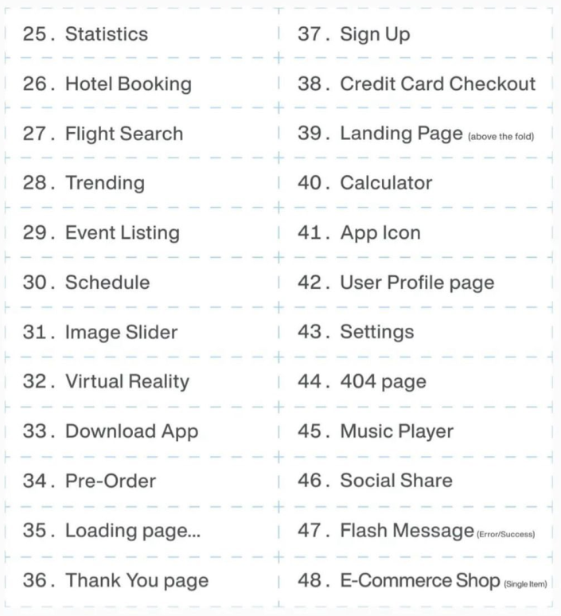
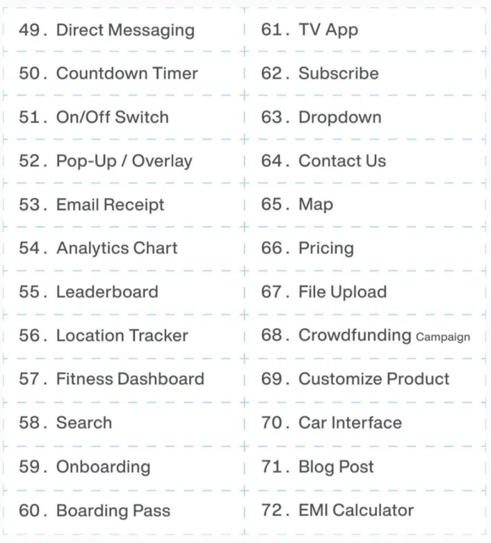
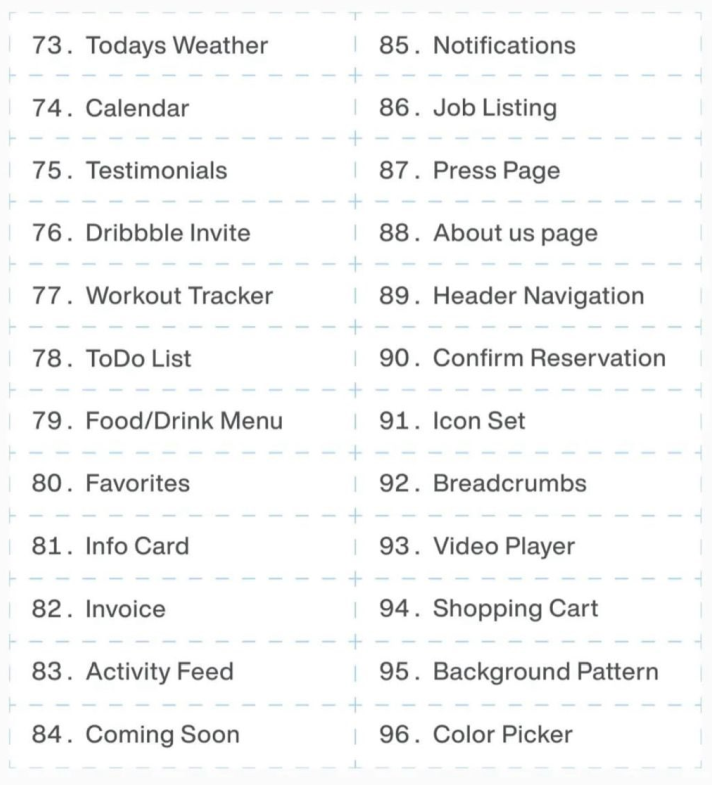

## Project Idea

After Completing JavaScript Concepts, we can do some project for practice purpose. These Practice can make's us strong in JavaScript Concepts and help us write quality code.

1. Projects Idea 1

2. Projects Idea 2

3. Projects Idea 3

4. Projects Idea 4

