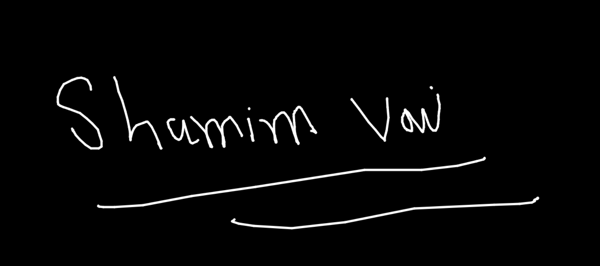

# JavaScript Canvas

What is Canvas?

Canvas gives you the power to draw graphics with JavaScript + HTML. It also can handle animations, photo editing and real-time video processing. **Canvas is very powerful with JavaScript.**

### Here is a canvas sample drawing

